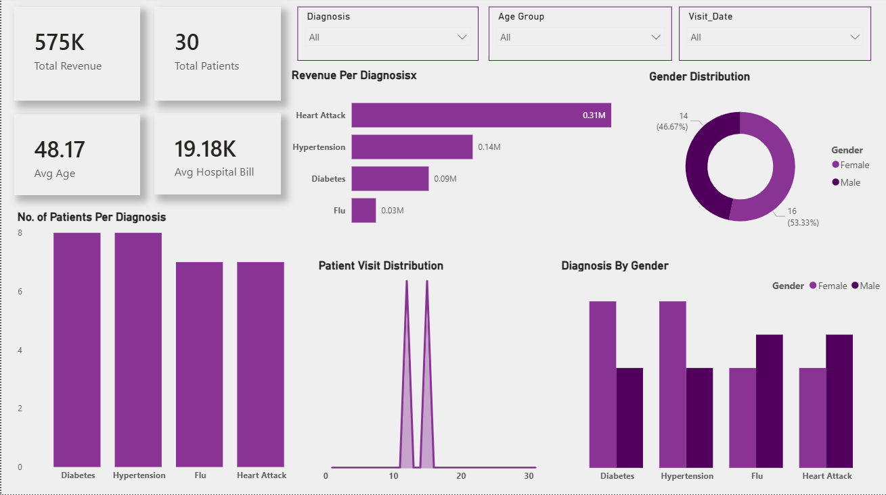

# medical-PowerBI-Dashboard

## 📌 Overview
This project is an interactive **Healthcare Analytics Dashboard** built using **Power BI** to analyze patient data, hospital revenue, and diagnosis trends. It provides meaningful insights into patient demographics, disease distribution, and financial metrics to support data-driven healthcare decisions.

---

## 🚀 Features

### 📊 KPIs Overview
- **Total Revenue:** 575K  
- **Total Patients:** 30  
- **Average Age:** 48.17  
- **Average Hospital Bill:** 19.18K  

### 🧠 Diagnosis Insights
- Revenue generated per diagnosis  
- Number of patients per disease (Diabetes, Hypertension, Flu, Heart Attack)  

### 👥 Demographic Analysis
- Gender distribution (Male vs Female)  
- Diagnosis trends by gender  

### 📅 Time-Based Analysis
- Patient visit distribution over time  

### 🎛️ Interactive Filters
- Diagnosis  
- Age Group  
- Visit Date  

---

## 🖼️ Dashboard Preview



---

## 🛠️ Tech Stack
- **Power BI** – Data visualization & dashboard creation  
- **Excel / CSV** – Data source  
- **DAX** – Calculated measures and KPIs  

---

## 📂 Project Structure

```
Medical-PowerBI-Dashboard/
│
├── Medical-project.pbix       # Main Power BI report file
├── Medical-project.mp4        # Dashboard demo video
├── Assets/
│   └── medical_data.csv       # Synthetic dataset
    └── Medical-dashboard.png
└── README.md
```

---

## 📊 Dataset

The dataset used in this project was synthetically generated using **ChatGPT** and is intended purely for educational and portfolio purposes. It simulates realistic hospital patient records including:

- Patient ID, Age, Gender
- Admission & Discharge Dates
- Ward / Department
- Admission Type (Emergency, Elective, etc.)

> ⚠️ This is not real patient data. No personally identifiable information (PII) is included.

---

## 🚀 How to Run

1. Clone or download this repository
2. Open `Medical-project.pbix` in **Power BI Desktop**
3. If prompted, refresh the data source to point to `dataset/medical_data.csv`
4. Explore the dashboard using the interactive filters and slicers

---

## 📸 Dashboard Preview

> 🎬 Watch the full demo: [Medical-project.mp4)

---

## 🙋 About Me

I'm a data enthusiast passionate about turning raw data into meaningful visual stories. This project is part of my portfolio as I pursue opportunities in **Data Analytics**.

📧 Connect with me on [LinkedIn](https://www.linkedin.com/in/azharsayeddd/) | ⭐ Star this repo if you found it helpful!
